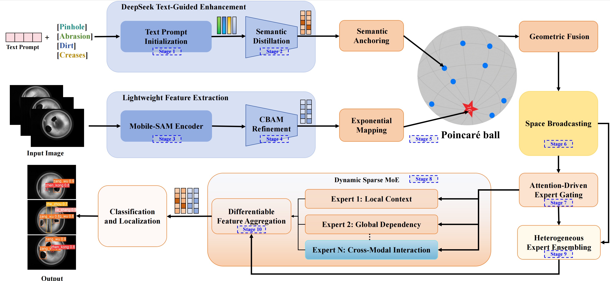

# Distilled LLM-Driven Dynamic Sparse Mixture-of-Experts

## 📘 Overview

This project implements the framework proposed in the paper **“Distilled Large Language Model (LLM)-Driven Sparse Mixture-of-Experts (DS-MoE)”**.  
The framework leverages **LLM-guided semantic-driven sparse expert activation** for cross-modal industrial defect detection, enabling joint text-visual understanding, dynamic expert routing, and lightweight feature extraction for multi-scale industrial inspection tasks (e.g., PCB, aluminum foil, molds).


---

## 🧩 Framework Overview


The core structure of the proposed DS-MoE model is illustrated below:


---

## 🧠 Key Features

- **Text-Guided Dynamic Expert Activation**  
  LLM semantic embeddings are used to selectively activate task-relevant experts (local texture, global structure, and cross-modal interaction).

- **Lightweight Mobile-SAM Feature Extraction**  
  Preserves micron-level defect details while achieving real-time detection efficiency.

- **Hyperbolic Alignment**  
  Maintains semantic hierarchy and geometric consistency in the Poincaré ball space.

- **Multi-Scale and Cross-Modal Fusion**  
  Spatial broadcasting and semantic convolution ensure adaptive scale fusion and modality alignment.

- **Dual-Head Decoupled Detection**  
  Independent classification and localization branches prevent gradient conflicts.


---

## 🧪 Experimental Results

DS-MoE outperforms conventional vision-based models across multiple industrial inspection benchmarks:

| Dataset | mAP@0.5 | mAP@0.5:0.95 | Precision | Recall |
|:--|:--:|:--:|:--:|:--:|
| BBMP (Glass Bottle Bottom) | **99.5%** | 85.2% | 98.3% | 98.1% |
| Aluminum Foil | **99.2%** | 57.7% | 97.8% | 98.1% |
| PCB Surface | **94.2%** | 53.4% | 96.8% | 96.8% |

---


## 🚀 Usage

### 1️⃣ Train the Model
```bash
python tools/train.py
```

### 2️⃣ Test the Model
```bash
python tools/test.py
```


---

## ⚙️ Environment Setup

- Python ≥ 3.9  
- PyTorch ≥ 2.0.1  
- CUDA ≥ 11.8  
- Dependencies：
  ```bash
pip install -r requirements.txt
```

---


## ✏️ Citation

If you use this code or dataset in your research, please cite the following paper:

> Q. Chen, Z. Zhang, et al.  
> *Distilled Large Language Model-Driven Dynamic Sparse Expert Activation Mechanism.*  
> **Applied Soft Computing**, vol. 185, 2025, 114037.  
> DOI: [10.1016/j.asoc.2025.114037](https://doi.org/10.1016/j.asoc.2025.114037)
